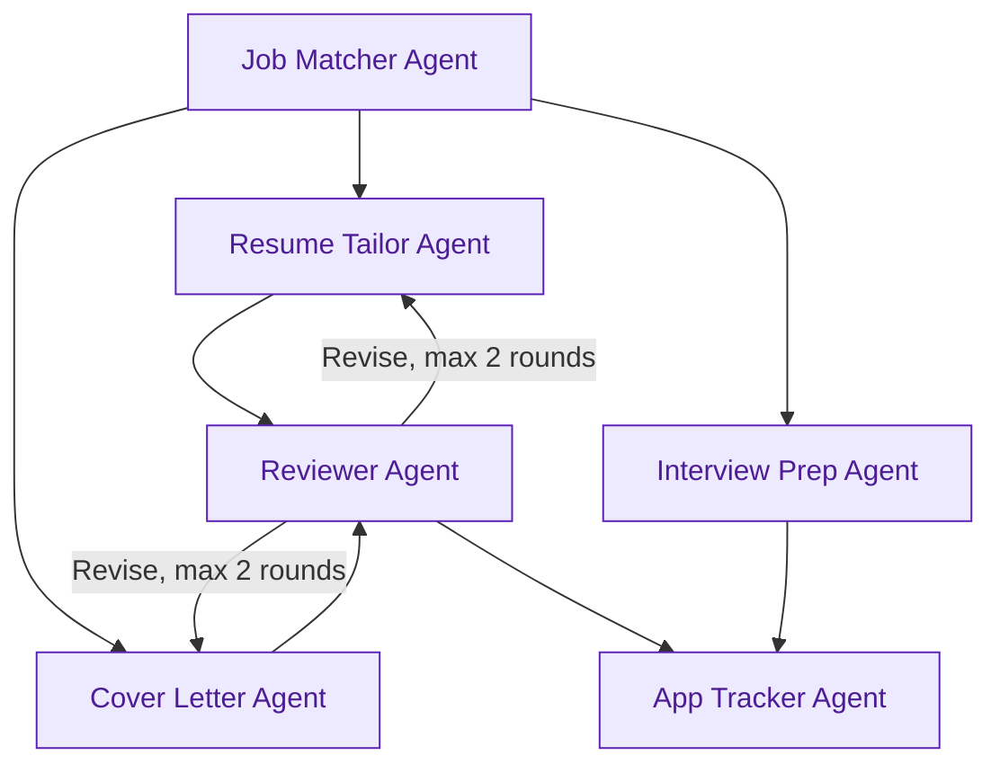
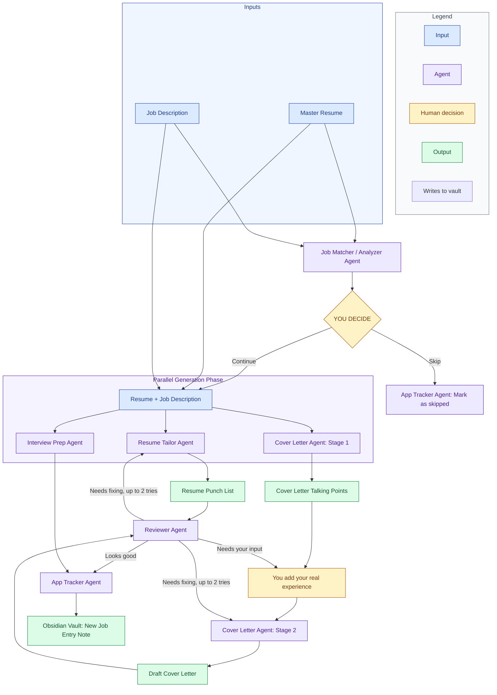

# Cairn for Jobs

[-orange?style=flat-square>)](#progress)
[](LICENSE)

> _A cairn is a stack of stones marking the way forward — **Cairn for Jobs** is a stack of AI agents marking where you are in the search._

> [!NOTE]
> Status: early development — see [Progress](#progress) below for what's done so far.

---

## The problem

Searching for a job at scale is exhausting. Customizing a resume for every
job posting, drafting authentic cover letters, preparing for interview
questions, and following up on applications can quickly become overwhelming.
As you apply to more positions, keeping track of active leads, old postings,
and tailored resumes becomes chaotic, leading to burnout and lost momentum.

---

## The solution

Cairn for Jobs is a self-hosted job search assistant built on top of
Obsidian. It automates the tedious parts of applying for jobs while keeping
all your files organized directly on your computer.

Instead of doing everything manually, you simply paste in a job
description, and Cairn:

1. **Evaluates job fit:** Summarizes key requirements and shows how well
   your background aligns, without deciding for you whether to apply.
2. **Keeps you in control:** Gives you a clear look at the fit assessment
   first, so you decide whether to move forward before anything else runs.
3. **Tailors your materials:** Generates a list of suggested resume edits,
   highlights interview topics to study, and asks for your real-world
   experience before drafting a cover letter.

---

## How the agents connect

Cairn is made up of six small AI agents, each handling one specific task.
The matcher looks at a posting first; if you decide to move forward, three
agents work at the same time to prepare your resume edits, cover letter,
and interview prep. A reviewer double-checks the resume and cover letter
before anything gets saved, sending things back for another pass if
something needs fixing. Once everything looks good, the tracker writes
the results into your Obsidian vault.



---

## Design principles

- **No web scraping.** You paste in job descriptions yourself, keeping
  things reliable and private.
- **You decide, the AI advises.** Cairn highlights pros and cons, but it
  never automatically hides or discards a job posting for you.
- **No generic AI cover letters.** The system asks for your actual
  experience first. It helps you write, but it never invents stories or
  fake details.
- **Bring your own API key.** Nothing runs on a middleman server. You use
  your own AI API key, so your data stays under your control.
- **Obsidian is your database.** No separate apps or accounts needed. Your
  job applications are stored as plain text files on your device and
  organized automatically into interactive tables and visual boards.

---

## Full pipeline overview

This is the same flow as above, but zoomed in on every step, including
where you paste things in, where you make a decision, and what each agent
actually produces along the way. Blue boxes are things you provide, purple
boxes are AI agents doing work, yellow boxes are moments where you are the
one acting, and green boxes are things an agent produces.



---

## Setup

### Prerequisites

- Obsidian (for viewing your vault & tracking job applications)
- Python 3.10+ (for running agent scripts)

### Quick Start

1. **Clone this repository:**

   ```bash
   git clone https://github.com/vincenttchi/cairn-for-jobs.git
   cd cairn-for-jobs
   ```

2. **Configure your environment:**

```bash
cp .env.example .env
```

_Open `.env` and fill in your Anthropic (`ANTHROPIC_API_KEY`) and/or OpenAI (`OPENAI_API_KEY`) credentials._

3. **Explore the Obsidian vault template:**
   Open `vault-template/` as an Obsidian vault to see the frontmatter schema and `.base` pipeline views.

_(Agent scripts land in later phases; this repo is currently just the foundation and Obsidian vault template)_

---

## Progress

- [x] Phase 0 — Repo foundation and Obsidian vault template
- [x] Phase 1 — Job matcher agent
- [x] Phase 2 — Finalizing the pipeline design
- [ ] Phase 3 — Resume tailor, cover letter, and interview prep agents _(In Progress)_
- [ ] Phase 4 — Reviewer agent and revision loop
- [ ] Phase 5 — App tracker agent and full pipeline orchestration
- [ ] Phase 6 — Public release polish

---

## License

Distributed under the MIT License. See [LICENSE](LICENSE) for more information.
